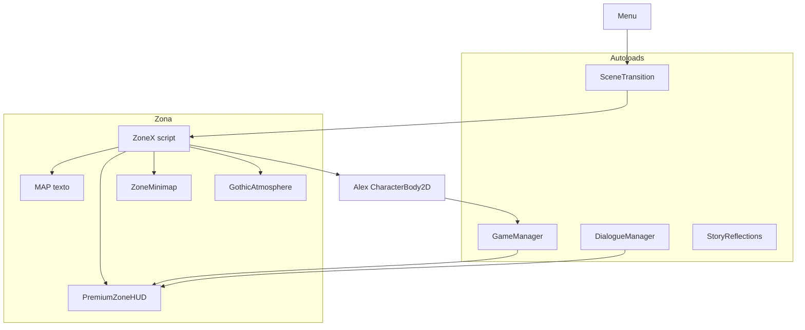

# LOST ECO — Guía del código (Godot 4.6)

Documento para entender **qué hace cada parte** del proyecto sin ser programador experto.

---

## 1. ¿Qué es este juego?

**Lost Eco** es un juego 2D en Godot sobre **bullying (acoso escolar)**. Alex recorre zonas del bosque, recoge ecos de memoria, aprende mecánicas distintas en cada nivel y termina en un claro para hablar con Mateo.

- **Motor:** Godot 4.6  
- **Resolución lógica:** 320×180 (se escala a 1280×720 en ventana)  
- **Carpeta principal:** `lost-eco/`  
- **Escena inicial:** `scenes/menu.tscn`

---

## 2. Controles del jugador

| Tecla | Acción en Godot | Uso en el juego |
|-------|-----------------|-----------------|
| W/A/S/D o flechas | `move_*` | Mover a Alex |
| **E** | `interact` | Interactuar (ecos, pilares, cristales, sellos, jefe) |
| **J** | `attack` | Pulso de luz (empuja enemigos; gasta carga) |
| **Q** | `drop_weapon` | Gesto de paz / soltar arma |
| **ESC** | `pause` | Pausa (o cerrar intro con E/ESC) |

---

## 3. Estructura de carpetas

```
lost-eco/
├── autoloads/          ← Scripts globales (siempre activos)
├── scenes/             ← Escenas .tscn (menú, zonas, Alex)
│   ├── menu.tscn
│   ├── world/          ← Zone1, Zone2, Zone3, Zone4, Clearing
│   └── player/         ← alex.tscn
├── scripts/
│   ├── mapa/           ← Lógica de cada zona + minimapa + niebla
│   ├── personaje/      ← Alex, animaciones, sprites
│   ├── enemigos/       ← Sombras, IA, jefe espejo
│   ├── puntuacion/     ← HUD, vidas, ecos
│   ├── menu/           ← Menú principal y opciones
│   └── cinematicas/    ← Efectos (shake, muerte, accesibilidad)
├── assets/             ← Sprites, shaders (niebla, viñeta)
└── project.godot       ← Configuración del proyecto
```

---

## 4. Autoloads (servicios globales)

Son nodos que **no se destruyen** al cambiar de escena. Están en `project.godot` → `[autoload]`.

### `GameManager.gd`
- **Vidas:** `current_health` / `max_health` (3 por defecto)
- **Puntos:** `score`
- **Empatía:** `empathy_level` (0 = agresivo, 1 = empático)
- **Jugador:** `player` (referencia a Alex)
- **Pausa:** menú ESC
- **GAME OVER:** pantalla con “Seguir jugando” o “Salir al menú”
- **`on_zone_completed()`:** restaura vidas al pasar de nivel

### `DialogueManager.gd`
- Mensajes en pantalla (esquina y centro)
- **`show_zone_intro()`:** cartel al empezar nivel (pasos numerados) → **[E] o [ESC] Continuar**
- **`ZoneMissionBriefs.gd`:** textos de misión para zonas 1–4 (siempre al entrar, también tras cinemática)
- **`show_corner_notice()`:** avisos cortos abajo
- **`show_reflection()`:** textos de historia (bullying)
- **`clear_all()`:** borra mensajes al ir al menú

### `SceneTransition.gd`
- Fade negro entre escenas
- Orden: **cinemática → fade out → cambio de escena → fade in**
- **`change_scene(ruta)`:** cambia de nivel limpiando diálogos
- **`play_bridge_and_change_scene(zona, ruta)`:** cinemática entre niveles + siguiente escena

### `ZoneCinematicDirector.gd`
- Cinemáticas a pantalla completa (intro + puentes entre zonas)
- Panel centrado, botón **Continuar [E]**, avance automático por diapositiva
- Saltar con **[E]**, **ESC** o **J**
- Tras cinemática: sigue mostrando el **intro completo** del nivel (objetivos paso a paso)
- Claves: `intro_campaign`, `bridge_1_2`, `bridge_2_3`, `bridge_3_4`, `bridge_4_clearing`

### `StoryReflections.gd`
- Diccionario de textos: `zone1_echo_1`, `zone3_memory_2`, `zone2_complete`, etc.
- **`get_echo_reflection(zona, n)`**, **`get_crystal_memory(n)`**

### `QuestManager.gd`
- Progreso por zona: `zone1` … `zone4`
- **`advance_quest("zone2")`** al completar un nivel

### `SettingsManager.gd`
- Volumen, resolución, daltonismo, skin del personaje
- **`CAMPAIGN_SCENES`:** orden de la campaña
- Guarda en `user://settings.cfg`

### `AudioManager.gd` / `UISounds.gd`
- Música y efectos (daño, sanación, UI)

### `MenuStateMachine.gd`
- Estados del menú: principal, opciones, pausa
- Al empezar partida resetea vidas y puntos

---

## 5. Flujo del juego (de principio a fin)

```
Menú (menu.tscn)
    ↓ Jugar
Zona 1 — Laberinto (Zone1_Labyrinth.tscn)
    ↓ 4 ecos + salida X
Zona 2 — Pantano (Zone2_Swamp.tscn)
    ↓ 3 pilares [E] + 3 ecos
Zona 3 — Cueva (Zone3_Cave.tscn)
    ↓ cristales + sellos + ecos + sanar jefe [E]/[Q]
Zona 4 — Río (Zone4_Rio.tscn)
    ↓ 3 ecos + salida
Clearing (Clearing.tscn)
    ↓ Diálogo final con Mateo
```

Cada zona es un `Node2D` con script en `scripts/mapa/ZoneX_....gd`.

---

## 6. El personaje Alex

| Archivo | Rol |
|---------|-----|
| `scenes/player/alex.tscn` | Escena: cuerpo, colisión, área de interacción |
| `scripts/personaje/Alex.gd` | Movimiento, daño, armas, gesto de paz [Q] |
| `scripts/personaje/GothicPlayerVisual.gd` | Sprite animado + luz alrededor |
| `scripts/personaje/CharacterArt.gd` | Carga PNG (disco o base64 embebido) |
| `scripts/personaje/PlayerAnimationFactory.gd` | Crea animaciones idle/run desde textura |

### Ciclo de vida de Alex
1. Al cargar la escena, Alex hace `_ready()` → `GameManager.player = self`
2. Se oculta el icono viejo de Godot y se muestra polígonos o sprite gótico
3. `_physics_process`: lee WASD, mueve con `move_and_slide()`
4. `can_move = false` cuando hay intro, pausa o GAME OVER

### `peace_gesture()` (tecla Q)
- Marca `has_weapon = false`
- Muestra mensaje “Manos vacías — sin violencia”
- En Zona 3, la zona escucha esto y puede sanar al jefe si estás cerca

---

## 7. Cómo funcionan las zonas (mapa)

Todas las zonas usan un **MAP** de texto: cada carácter es un tile de 16×16 píxeles.

| Símbolo | Significado |
|---------|-------------|
| `#` | Pared (colisión) |
| `.` | Suelo libre |
| `S` | Spawn de Alex |
| `E` | Eco coleccionable (estrella) |
| `X` | Salida (Zonas 1, 2, 4) |
| `P` | Pilar (solo Zona 2) |
| `B` | Jefe espejo (Zona 3) |

### Archivos por zona

| Zona | Script | Escena |
|------|--------|--------|
| 1 Laberinto | `Zone1_Labyrinth.gd` | `Zone1_Labyrinth.tscn` |
| 2 Pantano | `Zone2_Swamp.gd` | `Zone2_Swamp.tscn` |
| 3 Cueva | `Zone3_Cave.gd` | `Zone3_Cave.tscn` |
| 4 Río | `Zone4_Rio.gd` | `Zone4_Rio.tscn` |
| Claro | `Clearing.gd` | `Clearing.tscn` |

### Qué hace cada zona en `_ready()`
1. Genera mapa (`_generate_map`) — suelos, paredes, ecos
2. Crea enemigos
3. Crea HUD y minimapa (`ZoneUIBootstrap`)
4. **`call_deferred("_finish_player_setup")`** — coloca a Alex en `S` **después** de que exista
5. Intro con `DialogueManager.show_zone_intro`
6. Atmósfera: `GothicAtmosphere` (niebla + viñeta)

### Mecánicas por zona

**Zona 1 — Laberinto**
- Recoger **4 ecos** → desbloquea salida `X`
- Enemigos: sombras que quitan vida
- **[J]:** pulso de luz (empuja enemigos)

**Zona 2 — Pantano**
- **3 pilares `P`:** mantener **[E]** ~1.8 s cerca
- **3 ecos**
- Barro reduce velocidad
- Salida cuando pilares + ecos completos

**Zona 3 — Cueva**
- **3 cristales azules:** **[E]** → lee memoria
- **3 círculos dorados:** **[E]** → enciende luz
- **3 ecos** (estrellas)
- **Jefe `B`:** al completar todo → cinemática **Sala del Espejo** (cámara, sombras se van, teleport cerca del jefe) → **[E]** o **[Q]** para sanar
- Visual jefe: `MirrorBossVisual.gd` | enemigos: sprites (`susurrantes`)
- Niebla más clara (`cave_bright` en `GothicAtmosphere`)

**Zona 4 — Río**
- Agua lenta, **3 ecos**, salida **X**

---

## 8. UI en pantalla

| Componente | Archivo | Qué muestra |
|------------|---------|-------------|
| HUD zona | `PremiumZoneHUD.gd` | VIDAS, objetivos, puntos, cargas LUZ |
| Minimapa | `ZoneMinimap.gd` | Mapa pequeño; niebla se descubre al caminar |
| Mensajes | `DialogueManager.gd` | Intro, avisos, reflexiones |
| Pausa / Game Over | `GameManager.gd` | Paneles encima del juego |

**Capas (CanvasLayer):**
- Niebla: ~88  
- Viñeta: ~92  
- HUD: 100  
- Minimapa: 101  
- Mensajes: 110  
- Pausa: 120  
- Game Over: 125  

---

## 9. Enemigos

| Archivo | Uso |
|---------|-----|
| `EnemyBehavior.gd` | Patrulla, embestida, oleadas |
| `ShadowEnemyVisual.gd` | Dibuño rojo/ojos de la sombra |
| `MirrorGuardian.gd` | Jefe alternativo (escena separada; campaña usa polígono en Zone3) |

Al tocar al jugador: `GameManager.take_damage()` → pierde 1 vida → si llega a 0 → GAME OVER.

---

## 10. Niebla y atmósfera

**`GothicAtmosphere.gd`**
- Sigue la posición de Alex con un shader de niebla
- Temas: `labyrinth`, `swamp`, `cave_bright`, `river`
- `light_radius` = qué tan lejos ves (más alto = más visión)

**`GothicTilePainter.gd`**
- Pinta suelos y paredes en `_draw()` de cada zona

**`FollowCamera.gd`**
- Cámara sigue a Alex con zoom 2×

---

## 11. Sprites y personajes

1. PNG en `assets/sprites/` (alex.png, exploradora.png, enemigos…)
2. Si OneDrive bloquea archivos → `CharacterSpritesData.gd` tiene imágenes en **base64**
3. `CharacterArt.make_sprite("alex")` devuelve textura
4. Si falla → Alex usa **figura de polígonos** (cuadrados de colores)

---

## 12. Archivos que tocarías según lo que quieras cambiar

| Quiero cambiar… | Archivo |
|-----------------|---------|
| Textos de historia / ecos | `autoloads/StoryReflections.gd` |
| Mensaje al entrar a un nivel | Script de la zona → `show_zone_intro(...)` |
| Vidas o GAME OVER | `autoloads/GameManager.gd` |
| Mapa Zona 1 | `scripts/mapa/Zone1_Labyrinth.gd` → constante `MAP` |
| Posición de enemigos | `ENEMY_TILES` en cada ZoneX |
| Teclas | `project.godot` → `[input]` |
| Orden de niveles | `SettingsManager.gd` → `CAMPAIGN_SCENES` |
| Brillo / niebla | `GothicAtmosphere.gd` o tema en `setup(..., "cave_bright")` |
| HUD (vidas, tamaño) | `scripts/puntuacion/PremiumZoneHUD.gd` |
| Sprites Alex | `assets/sprites/` + `CharacterArt.gd` |

---

## 13. Orden de ejecución (importante para bugs)

Godot ejecuta `_ready()` **del padre antes que el hijo**.

```
Zone1_Labyrinth._ready()     ← A veces GameManager.player aún es null
    └── Alex._ready()        ← Aquí se asigna GameManager.player
```

Por eso las zonas usan **`call_deferred("_finish_player_setup")`**: espera un frame, coloca a Alex en `S`, aplica niebla y HUD.

---

## 14. Patrones de diseño en el código

No hay un único patrón (como MVC puro). El proyecto mezcla varios, típicos en Godot:

| Patrón | Dónde está | Para qué sirve aquí |
|--------|------------|---------------------|
| **Singleton (Autoload)** | `GameManager`, `DialogueManager`, `SceneTransition`, `ZoneCinematicDirector`, `QuestManager`, … | Un solo servicio global accesible desde cualquier escena |
| **State** | `MenuStateMachine` + `scripts/menu/states/*.gd` | Menú principal, opciones y pausa como estados intercambiables |
| **Observer (señales)** | `GameManager.health_changed`, `Alex.action_performed`, `QuestManager` | La UI y las zonas reaccionan sin acoplarse al jugador |
| **Bootstrap / Factory** | `ZoneUIBootstrap`, `ZoneVisualBootstrap`, `PlayerAnimationFactory`, `EnemyBehavior` | Crear HUD, colocar al jugador, animaciones e IA sin duplicar código en cada zona |
| **Data-driven** | `CINEMATICS` en `ZoneCinematicDirector`, `StoryReflections`, cadenas `MAP` en cada zona | Contenido (textos, mapas, diapositivas) separado de la lógica |
| **Strategy (ligero)** | `GothicAtmosphere` (temas por zona), `EnemyBehavior` (patrulla, emboscada) | Comportamiento intercambiable según contexto |

**Patrón principal del menú:** **State** — el comentario en `MenuStateMachine.gd` lo documenta explícitamente.

**Patrón principal del juego en marcha:** **Singleton + Observer** — autoloads guardan estado y emiten señales; las escenas de zona escuchan y actualizan HUD/mapa.

Las zonas (`Zone1_Labyrinth.gd`, etc.) son scripts **monolíticos por nivel** (mapa + mecánicas + victoria en un archivo), no un MVC estricto.

---

## 15. Diagrama simplificado



---

## 16. Código legacy (no usar para la campaña principal)

En `scripts/systems/` y `scripts/core/` hay versiones antiguas (pantano procedural, `PlayerController2D`). La campaña actual usa **`scripts/mapa/`** y **`scenes/world/`**.

---

## 17. Cómo abrir esta documentación

- En el explorador de archivos del repo:  
  `lost-eco/DOCUMENTACION_CODIGO.md`
- En Cursor/VS Code: clic en el archivo para leerlo con formato
- Puedes exportarlo a PDF desde el visor de Markdown si lo necesitas para clase o entrega

---

*Última actualización: campaña Zonas 1–4 + Clearing, cinemáticas, patrones de diseño documentados, HUD, GAME OVER.*
